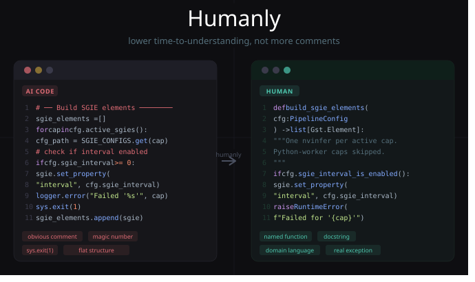

# Humanly

[](https://github.com/AlejandroMova/Humanly/releases/latest)

> A Claude skill that transforms AI-generated or messy code into clean,
> human-readable code.

---

## What it does

AI-generated code often works but reads poorly. It tends to:

- Comment the obvious (`# increment counter`) while skipping the non-obvious
- Use generic names (`data`, `result`, `process_X`) with no domain meaning
- Leave magic sentinel values unexplained (`if interval >= 0` — what does `-1` mean?)
- Flatten logic into long procedural blocks that need banner comments to navigate
- Stick mid-function imports where they don't belong
- Wrap everything in defensive try/except that swallows real errors

Humanly fixes this. It operates on the principle that **good code has low cognitive
load** — a reader shouldn't have to hold much in their head to understand a block.
Structure comes first; comments follow only where structure can't speak for itself.

---

## Modes

**Review mode** — annotated feedback explaining what to change and why. Good for
learning or preparing a PR.

**Rewrite mode** — produces the cleaned version directly. Always preserves behavior;
never changes logic, algorithms, or side effects.

---

## Supported languages

- Python
- C++
- JavaScript / TypeScript
- Config files (YAML, TOML, DeepStream `.cfg`, `.env`)

---

## Installation

### Claude.ai

1. Download `humanly.skill` from the [latest release](https://github.com/AlejandroMova/humanly/releases/latest)
2. Go to **Settings → Skills**
3. Click **Install from file** and select `humanly.skill`

### Claude Code (terminal)

```bash
mkdir -p ~/.claude/skills/humanly
curl -L https://github.com/AlejandroMova/Humanly/releases/latest/download/humanly.skill -o /tmp/humanly.skill
unzip /tmp/humanly.skill -d ~/.claude/skills/humanly
```

Restart Claude Code — the skill is available immediately.

---

## Example

**Before** (AI-generated DeepStream pipeline code):

```python
# ── SGIEs — one per active capability beyond people_counting ──────────────
sgie_elements = []
for cap in cfg.active_sgies():
    cfg_path = SGIE_CONFIGS.get(cap)
    if cfg_path is None:
        logger.info("Capability '%s' uses Python worker — skipping SGIE", cap)
        continue
    sgie = Gst.ElementFactory.make("nvinfer", f"sgie-{cap}")
    if not sgie:
        logger.error("Could not create nvinfer element for capability '%s'", cap)
        sys.exit(1)
    sgie.set_property("config-file-path", cfg_path)
    if cfg.sgie_interval >= 0:
        sgie.set_property("interval", cfg.sgie_interval)
    sgie_elements.append(sgie)
    logger.info("SGIE loaded: %s → %s", cap, cfg_path)
```

Issues: banner comment compensating for missing function, magic `>= 0` sentinel,
`sys.exit(1)` gives callers no recovery path, flat block mixes creation + config.

**After** (Humanly rewrite):

```python
def build_sgie_elements(cfg: PipelineConfig) -> list[Gst.Element]:
    """Instantiate one nvinfer SGIE element per active capability.

    Capabilities backed by Python workers are skipped — they don't
    use a GStreamer inference element and are handled downstream.
    """
    elements = []

    for cap in cfg.active_sgies():
        cfg_path = SGIE_CONFIGS.get(cap)

        if cfg_path is None:
            # Python-worker capability — no GStreamer element needed
            logger.info("Skipping SGIE for '%s': handled by Python worker", cap)
            continue

        sgie = _create_nvinfer_element(cap, cfg_path, cfg)
        elements.append(sgie)
        logger.info("SGIE loaded: %s → %s", cap, cfg_path)

    return elements


def _create_nvinfer_element(cap, cfg_path, cfg) -> Gst.Element:
    """Create and configure a single nvinfer GStreamer element.

    Raises:
        RuntimeError: If GStreamer cannot create the element.
    """
    sgie = Gst.ElementFactory.make("nvinfer", f"sgie-{cap}")
    if not sgie:
        raise RuntimeError(
            f"GStreamer failed to create nvinfer element for capability '{cap}'"
        )

    sgie.set_property("config-file-path", cfg_path)

    if cfg.sgie_interval_is_enabled():
        # Interval controls frames skipped between inferences.
        # Lower = more accurate, higher = cheaper. Set per client config.
        sgie.set_property("interval", cfg.sgie_interval)

    return sgie
```

See `examples/` for more before/after pairs.

---

## Project structure

```
humanly/
├── SKILL.md                  # The skill instructions
├── README.md                 # This file
├── examples/
│   ├── before/               # Original messy code samples
│   └── after/                # Humanly-cleaned versions
└── references/
    ├── python.md             # Python-specific rules
    ├── cpp.md                # C++ rules
    ├── js.md                 # JavaScript/TypeScript rules
    └── configs.md            # YAML, TOML, DeepStream configs
```

---

## Philosophy

> "The goal isn't more comments. It's lower cognitive load."

Inspired by *A Philosophy of Software Design* (Ousterhout) and *Clean Code*
(Martin). The core insight: AI code often has *more* comments but is *harder*
to understand because the structure itself is confusing. Fix the structure
first. Comment only where structure can't explain intent.

---

## Contributing

PRs welcome, especially:
- New before/after examples in any supported language
- Additional language references (Rust, Go, etc.)
- Edge cases where the rules conflict or need nuance

---

Built with [Claude](https://claude.ai) · MIT License
